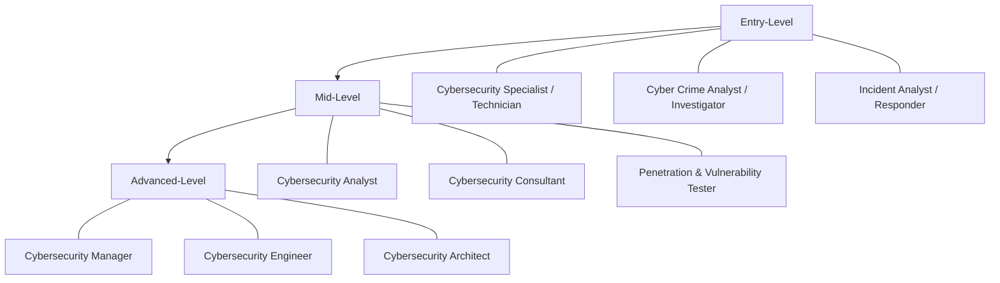

# Cybersecurity Roles and Responsibilities

## Overview

## Definition

A `Cybersecurity analyst` role can be more all-encompassing: a senior position within an organisation's security team with direct responsibility for protecting sensitive information and preventing unauthorised access to electronic data and the systems that protect it.

Any device that processes or uses our information is covered by the role of a cybersecuirity analyst.

## Function

* Implementing and configuring secuirity controls
* Auditing security processes and procedures
* Conducting risk assessments, vulnerability assessments, and penetration tests
* Maintaining up-to-date threat intelligence

# Security Operations Centre (SOC)

## Definition

A location where security professionals monitor and protect critical information assets in an organisation.

A few things that a SOC needs to have to be successful:

1. Have the Authoritiy to Operate
2. Have modtivated and skilled professionals
3. Incorporate processes into a single center
4. Equipped to perform incident response
5. Protect itself and the organisation at large
6. Can seperate the signal from the noise
7. Collaborate with other SOCs for data sharing

The SOC should be the single point of contact for security, monitoring and incident response.