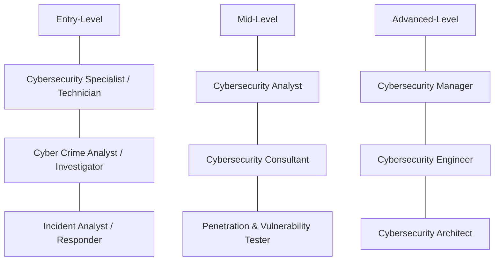

# Cybersecurity Roles and Responsibilities

## Overview 

A `Cybersecurity analyst` role can be more all-encompassing: a senior position within an organisation's security team with direct responsibility for protecting sensitive information and preventing unauthorised access to electronic data and the systems that protect it.

Any device that processes or uses our information is covered by the role of a cybersecuirity analyst.