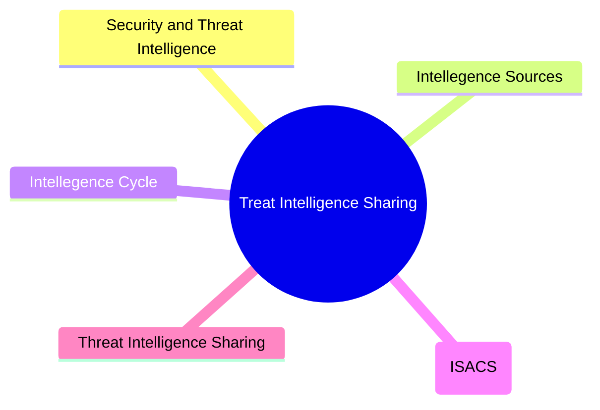
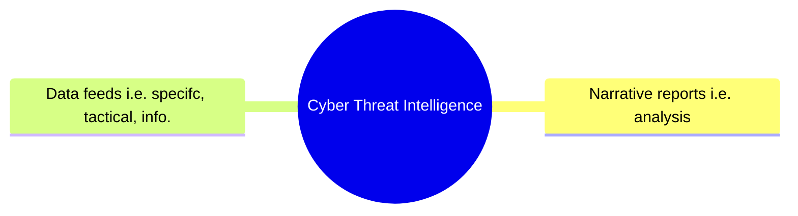

# Threat Intelligence Sharing

## Overview

## Security and Threat Intelligence

The process where data is generated and is then collected, processed, analysed, and disseminated to provide insights into the security status of information systems.

## Cyber Threat Intelligence

Investigation, collection, analysis, and dissemination of information about emerging threats and threat sources to provide data about the external threat landscape.

### Lesson

So, when we talking about security intelligence we're thinking inward, how are our systems looking? But when we are talking about cyber threat intelligence, we're looking outward. Attack groups, zero day exploits etc.
We need both of these forms of intelligences.

## Intelligence Cycle

It is a proccess:

1. Requirements (Planning & Direction)

    * Sets out the goals for the intelligence gathering process

    * What are the things we want to measure?

2. Collection (& Processing)

    * Implemented by software tools to gather data which is the processed for later analysis

    * The processing part is where we will convert all the data into a standard format (normalise the data that comes from seperate systems)

3. Analysis

    * Performed against the given use cases from the planning phase and may utilise autimated analysis, AI, and machine learning

    * We can start be seperating our data into three buckets: known good (allow), known bad (block), Not sure (analyse further)

4. Dissemination

    * Publishing the information produced by analysts to consumers who need to act on the insights developed:

        * Strategic
        * Operational
        * Tactical

5. Feedback

    * Aims to clarify the requirements and improve the collection, analysis, and dissemination of information by reviewing current inputs and outputs
