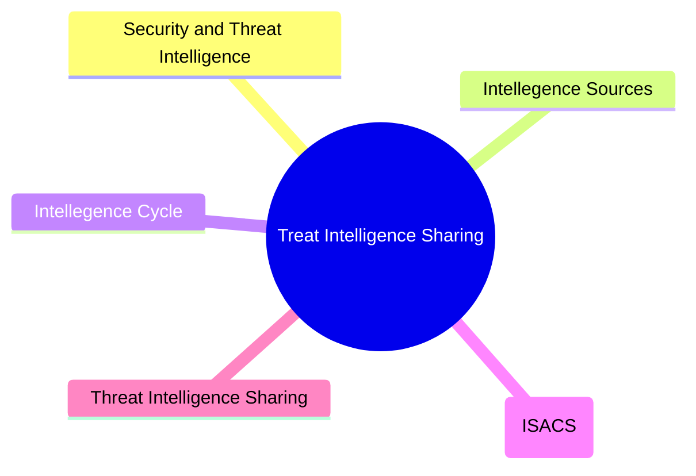
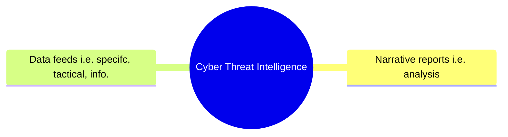

# Threat Intelligence Sharing

## Overview

## Security and Threat Intelligence

The process where data is generated and is then collected, processed, analysed, and disseminated to provide insights into the security status of information systems.

## Cyber Threat Intelligence

Investigation, collection, analysis, and dissemination of information about emerging threats and threat sources to provide data about the external threat landscape.

### Lesson

So, when we talking about security intelligence we're thinking inward, how are our systems looking? But when we are talking about cyber threat intelligence, we're looking outward. Attack groups, zero day exploits etc.
We need both of these forms of intelligences.

## Intelligence Cycle

It is a proccess:

1. `Requirements (Planning & Direction)`

    * Sets out the goals for the intelligence gathering process

    * What are the things we want to measure?

2. `Collection (& Processing)`

    * Implemented by software tools to gather data which is the processed for later analysis

    * The processing part is where we will convert all the data into a standard format (normalise the data that comes from seperate systems)

3. `Analysis`

    * Performed against the given use cases from the planning phase and may utilise autimated analysis, AI, and machine learning

    * We can start be seperating our data into three buckets: known good (allow), known bad (block), Not sure (analyse further)

4. `Dissemination`

    * Publishing the information produced by analysts to consumers who need to act on the insights developed:

        * Strategic
        * Operational
        * Tactical

5. `Feedback`

    * Aims to clarify the requirements and improve the collection, analysis, and dissemination of information by reviewing current inputs and outputs

## Intelligence Sources

With 2. `Collection (& Processing)` we need to consider:
    1. Evaluation
    2. Sources

There are several factors we can use:

* Timeliness: _Ensure that an intelligence souce is up-to-date_

* Relevancy: _Esures an intelligence source matches its intended use case_

* Accuracy: _Ensures an intelligence source produces effective results_

* Confidence Level: _Ensure an intelligence source produces qualified statements about reliability_

The MISP Projects codifies the use of the admiralty scale for grading data and estimative language

**Additional reading**:

* [MISP taxonomies and classification](https://www.misp-project.org/taxonomies.html#_admiralty_scale)

* [Best Practices in Threat Intelligence - MISP](https://www.misp-project.org/best-practices-in-threat-intelligence.pdf)

There are three sources of information:

1. Proprietary
2. Closed-Source
3. Open-Source
    * US-CERT
    * MISP
    * UK's NCSC
    * AT&T Security
    * VirusTotal
    * Impicit (can't be documented, it's based on experience - an inuition) and Explict Knowledge (can be shared)
    * OSINT

## Information Sharing and Analysis Centres (ISAC)

Can be split by industry for example, there can be an ISAC (or equivalent) for:

* Critical Infrastructure
    * Any physical or virtual infrastructure considered so vital that their incapacitation or destruction would have a debilitating effect on security, national economic security, national public health or safety, or any combination of these.

* Government
    * Serves non-federal governments in the US, such as state, local, tribal, and territorial governments.

* Healthcare
    * Serves healthcare providers that are often targets of criminals seeking blackmail and ransom opportunities by compromising patient data records or interfering with medical devices.

* Financial
    * Serves the financial sector to prevant fraud and extortion of both the consumer and the financial institutions.

* Aviation
    * Serves the aviation industry to prevent fraud, terrorisim, service disruptions, and unsafe operations of air traffic control systems.

## Threat Intelligence Sharing

Our goal here is to shoare our threat intelligence within the organisation (dissemination)

### Risk Management

Identifies, evaluations, and prioritizes threats and vulnerabilities to reduce their impact.

### Incident Response

An organised approach to addressing and managing the aftermath of a cybersecurity attack or breach. The best kind of intelligence here would be tactical-level intelligence.

### Vulnerability Management

The practice of identifying, classifying, prioritizing, remediating, and mitigating software vulnerabilities:

 * IoT devices
 * Deepfakes
 * AI fuzzing

#### Detection and Monitoring

The practice of observing activity to identify anomalous patterns for further analysis.