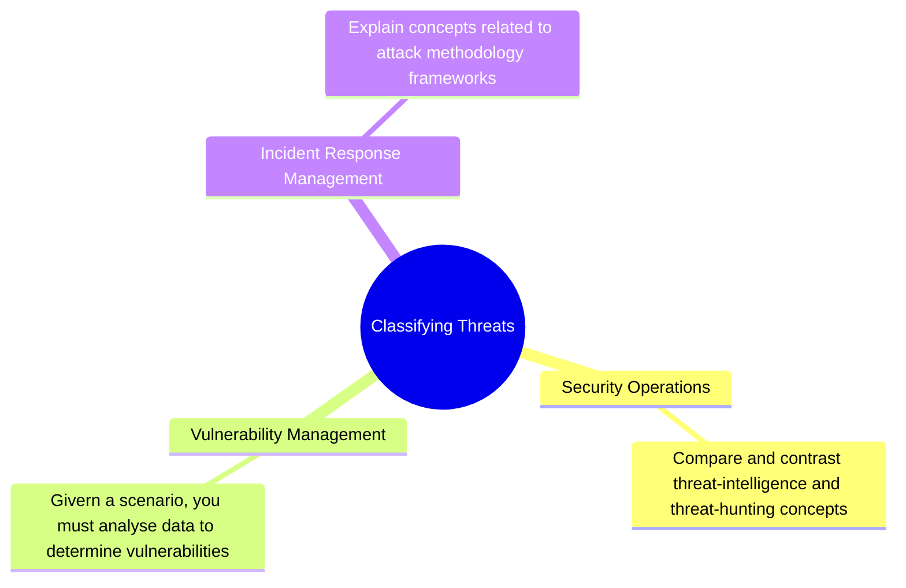
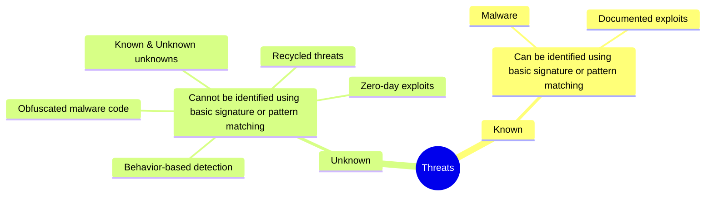
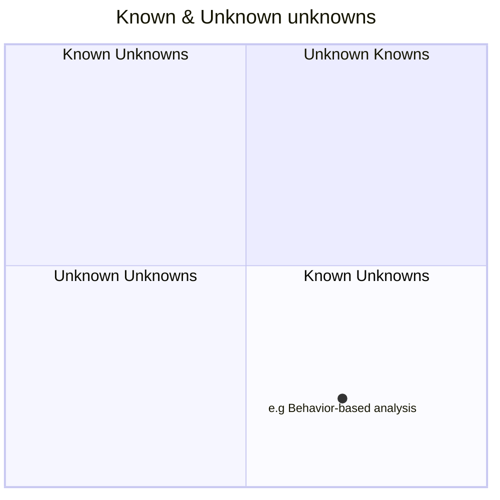

# Classifying Threats

## Overview

## Threat Classificiations

More on the `Known & Unknown unknowns`

All of this is based on the concept of a [Johari Window.](https://www.mindtools.com/au7v71d/the-johari-window)