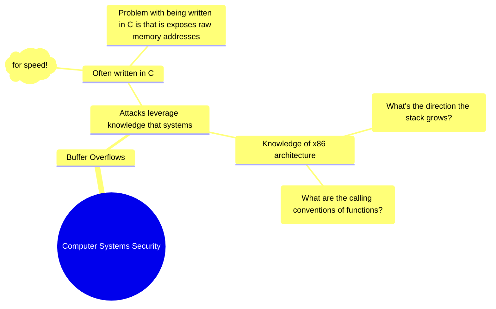

# Computer Systems Security

[Computer Systems Security](https://ocw.mit.edu/courses/6-858-computer-systems-security-fall-2014/resources/lecture-1-introduction-threat-models/)

```mermaid
mindmap
  root((Computer Systems Security))
    Buffer Overflows
        Attacks leverage knowledge that systems
            Often written in C
                )for speed!(
                Problem with being written in C is that is exposes raw memory addresses
            Knowledge of x86 architecture
                (What's the direction the stack grows?)
                (What are the calling conventions of functions?)
        
```