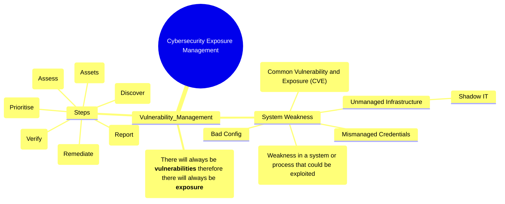

```mermaid

mindmap
  root((Cybersecurity Exposure Management))
    Vulnerability_Management
            text("There will always be **vulnerabilities** therefore there will always be **exposure**")
        System Weakness
            text("Weakness in a system or process that could be exploited")
            text("Common Vulnerability and Exposure (CVE)")
            Bad Config
            Mismanaged Credentials
            Unmanaged Infrastructure
                Shadow IT
        Steps
            1. (Discover)
            2. (Prioritise)
            3. (Assets)
            4. (Assess)
            5. (Report)
            6. (Remediate)
            7. (Verify)
```