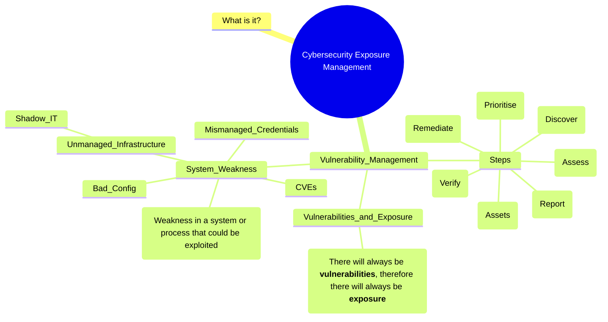

```mermaid
            mindmap
            root((Cybersecurity Exposure Management))
                What is it?
                Vulnerability_Management
                    Vulnerabilities_and_Exposure
                        text("There will always be **vulnerabilities**, therefore there will always be **exposure**")
                    System_Weakness
                        text("Weakness in a system or process that could be exploited")
                        CVEs
                        Bad_Config
                        Mismanaged_Credentials
                        Unmanaged_Infrastructure
                            Shadow_IT
                    Steps
                        1. (Discover)
                        2. (Prioritise)
                        3. (Assets)
                        4. (Assess)
                        5. (Report)
                        6. (Remediate)
                        7. (Verify)
```